# Installing and logging into Micromine using OpenVPN Access Client[^1]
[^1]: The most updated version of this README will be kept at <https://github.com/rlabeangeo/NeWorldRes/blob/main/README.md>

---

Items covered within this SOP

- Logging into the OpenVPN web portal
- Accessing and installing the OpenVPN client
	- Updating your configuration by uploading a connection profile
- Logging into the VPN to access the Micromine License Server
- Checking out a license from the server to use Micromine
- Troubleshooting common problems

---

## Logging into OpenVPN web portal

OpenVPN provides a custom configured installation file so that the end user will be completely ready to log into the VPN after the application is installed. To access this installation file point your browser to the location of the web server at:

<https://75.226.134.165:943>

At this point you are likely seeing a message similar to the one below, but do not be worried. Since the link above leads directly to a private network and not a website with a signed SSL certificate, your browser will give you a warning. Just make sure that the numbers in your address bar match the ones on this page and you will be ok continue. You will need to click the 'Advanced' button and then click the link the says something similar to "Proceed to this website anyway".

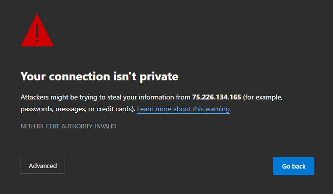\

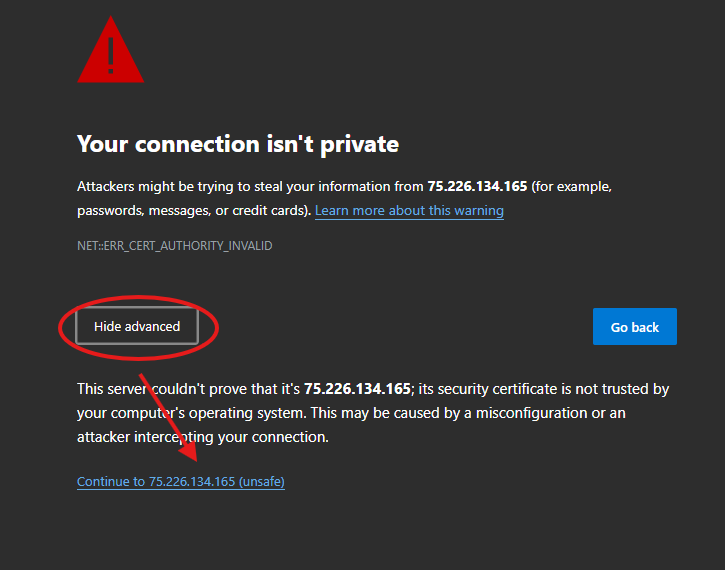\

Then login with the credentials supplied in the email you received with this document.

## Accessing and Installing the OpenVPN Access Client

At this point it is time to download and install the client and Windows makes this a little annoying. Once you have logged into the web portal the next step is to download the Access client application along with it's custom configuration. Since the application is custom configured for each user Windows Defender thinks each instance is a unique program, and therefore, cannot identify it to make sure it is safe. **It is**. Once you have the file downloaded you will likely be gifted with a warning in your browser downloads area. To get around this and actually save the file you will need to follow the inctructions below.

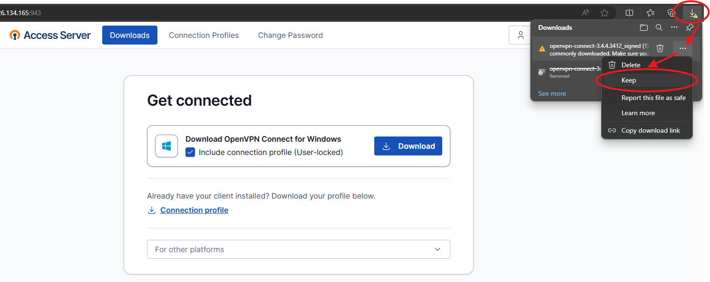\

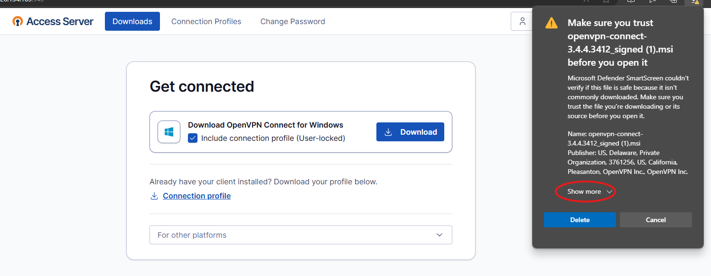\

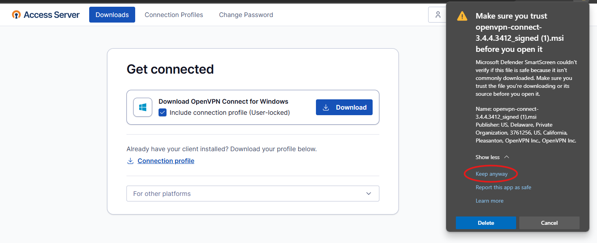\

Once you've finally gotten the file saved, you can open it to start the installation. You will, again, likely have to tell Windows that the file is ok. Just select "More Info" and then 'Run Anyway' to start the installation.

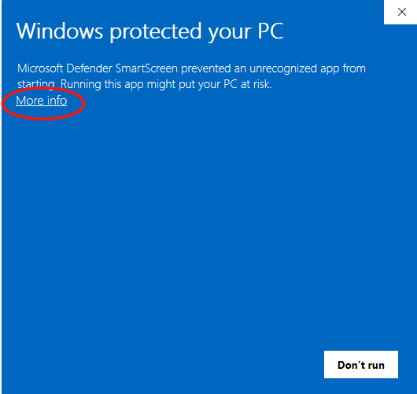\

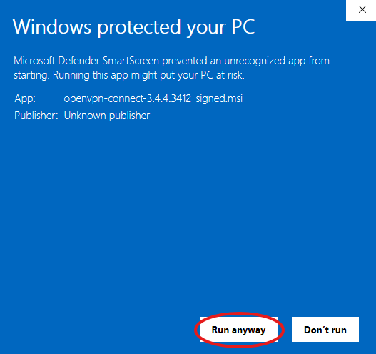\

Accept the Terms and Conditions and when finished the OpenVPN Access Client should be ready to use. 

### Updating your configuration by uploading a new connection profile

If you have already downloaded the OpenVPN Access Client, or you need to update your connection profile (only needed when instructed by whoever is managing the server). You can click the "Connection Profile" link to download a new connection profile. Then, inside the OpenVPN Access Client, click the plus ('+') button to add a new profile and select the "Upload File" tab. From here you can browse to the folder where your file was downloaded and select the `profile-userlocked-<username>.ovpn` file (where `<username>` is your username). This will add a new profile with the new configuration settings. The profile labeled "Bundled" is the one that was installed when you installed the OpenVPN Access Client originally and can be deleted or not used. 

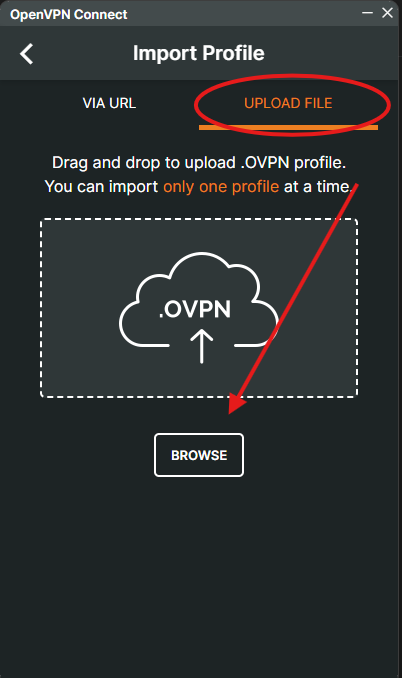\

\

## Logging into the VPN to access the Micromine License Server

Once you have the OpenVPN Access Client installed, connecting just requires opening the application and clicking the button on the appropriate profile (should only be 1 for now).

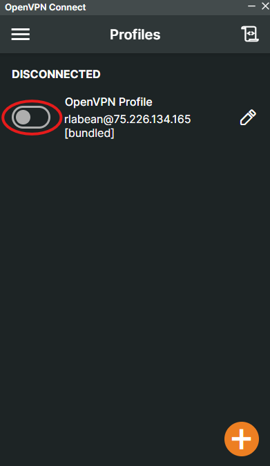\

Once the VPN client is connected you should have access to the local network at the office (Verizon_RJC639). This will allow you to access any shared devices on the network (only the Micromine License Server and printers currently) in the future. 

## Checking Out a License from the Micromine License Server

If you have the LM-X Configuration Tool installed continue from here, if not follow the link below to the Micromine instructions for adding a network license. Once connected to the VPN if you open the LM-X Configuration Tool (should be bundled with Micromine), and move to the 'Query License Server' tab we can check to make sure you can see the license server. In the "Host (Name or IP Address)" bar we can add the IP address of the server to `192.168.1.185` and change the "Port" from `6200` to `6262`.

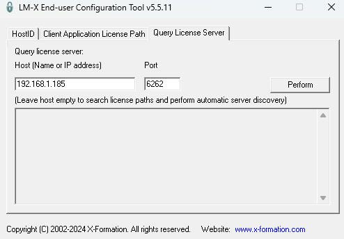\

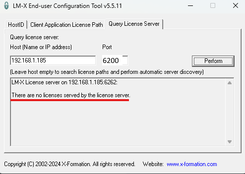\

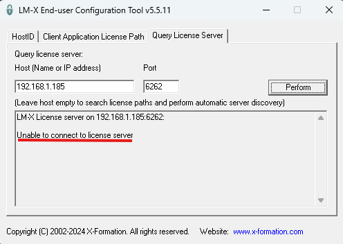\

From here, I will direct you to the [Micromine documentation](https://webhelp.micromine.com/mm/22.5/English/Content/mmtools/IDH_LICENCE_NETWORK_ACTIVATE.htm?tocpath=Home%7CLicensing%7CLicence%20Manager%7CNetwork%20Licences%7C_____2) for accessing the licenses located on the server. This will direct you how to load and activate any licenses, with minor changes that will be listed below.

Starting from the line "On *your local* machine, ...", continue until step 4. From here, do not click 'Discover', because we are not using the default port number for the Micromine License Server. Instead, click the green '+' button and add the IP addresss and port number of the server: 

`6262@192.168.1.185`

From this point, you can follow the Micromine instructions for activating the license. 

